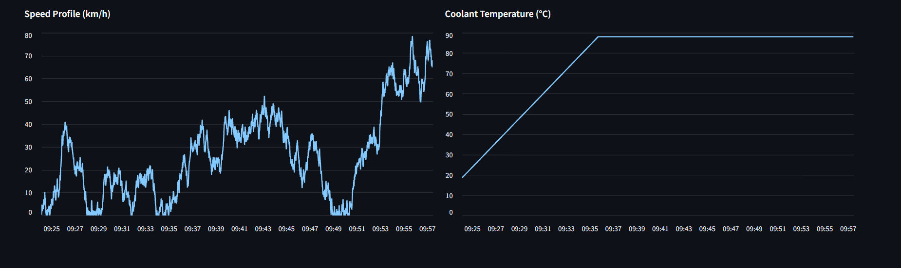
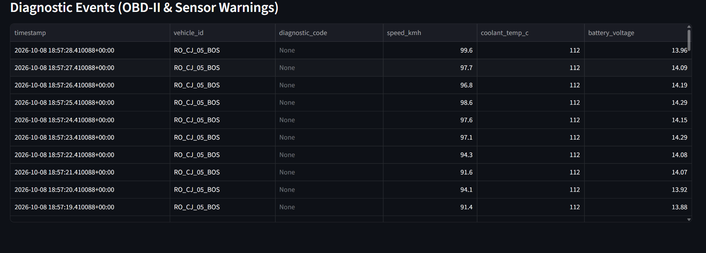
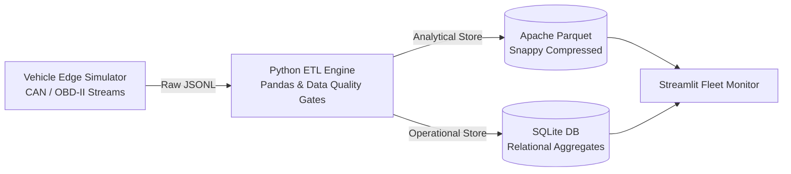

# 🚗 Vehicle-to-Cloud (V2C) Telemetry & Fleet Analytics Pipeline

[](https://www.python.org/)
[](https://www.docker.com/)
[](https://streamlit.io/)
[](#system-architecture)
[](https://opensource.org/licenses/MIT)

An end-to-end Data Engineering pipeline simulating IoT connected-vehicle telemetry ingestion, automated data validation, dual-layer operational/analytical storage, and live fleet health monitoring.

---

## 📸 Dashboard Preview

| Vehicle Telemetry & Thermal Profiles | Diagnostic Trouble Codes (OBD-II) |
| :---: | :---: |
|  |  |

---

## 🏛️ System Architecture

The pipeline implements a **Dual-Layer Storage Architecture**: analytical cold storage optimized for columnar querying alongside a relational operational store for fast transactional metrics.



### Key Engineering Features
* **Physics-Constrained Simulation:** Generates multi-vehicle feeds (speed, engine RPM, coolant thermal inertia, battery voltage, GPS) coupled with synthetic sensor noise and OBD-II fault codes (`P0217`, `P0117`, `P0300`).
* **Data Quality Gates:** Discards invalid packets, out-of-range sensor spikes, and hardware dropouts before persistence.
* **Dual Storage Strategy:**
  * **Analytical Layer (`.parquet`):** Columnar format compressed with Snappy via `pyarrow` for low-latency time-series scans.
  * **Operational Layer (`.db`):** Relational tables (`fleet_summary`, `diagnostic_alerts`) indexed for rapid dashboard KPI lookups.
* **Interactive Fleet Console:** Real-time metrics visualization with vehicle-level slicing and critical thermal/voltage threshold tracking.

---

## 📂 Project Structure

```text
vehicle-to-cloud-telemetry-pipeline/
├── assets/                  # Dashboard screenshots and architectural diagrams
├── data/
│   ├── raw/                 # Streaming JSONL ingestion dropzone
│   └── processed/           # Parquet analytical store & SQLite database
├── src/
│   ├── generate_data.py     # Vehicle telemetry simulation engine
│   ├── etl_pipeline.py      # Sanitization, feature engineering & dual loading
│   └── app.py               # Streamlit web dashboard
├── Dockerfile               # Multi-stage container definition
├── requirements.txt         # Pinned runtime dependencies
├── .gitignore
└── README.md
```

---

## 🚀 Quickstart

### Prerequisites
* Python 3.11+
* Git
* (Optional) Docker

### Native Setup

1. **Clone the repository:**
   ```bash
   git clone https://github.com/demidovcezar/vehicle-to-cloud-telemetry-pipeline.git
   cd vehicle-to-cloud-telemetry-pipeline
   ```

2. **Create and activate a virtual environment:**
   ```bash
   python -m venv .venv
   # On Windows:
   .\.venv\Scripts\activate
   # On Linux/macOS:
   source .venv/bin/activate
   ```

3. **Install dependencies:**
   ```bash
   pip install -r requirements.txt
   ```

4. **Run pipeline sequentially:**
   ```bash
   # 1. Generate 10,000 raw telemetry packets
   python src/generate_data.py

   # 2. Run ETL pipeline (clean, aggregate, store)
   python src/etl_pipeline.py

   # 3. Launch monitoring dashboard
   streamlit run src/app.py
   ```
   Open `http://localhost:8501` in your browser.

---

### Docker Deployment

To build and run the entire self-contained pipeline within a Docker container:

```bash
# Build Docker image
docker build -t vehicle-telemetry-pipeline .

# Run container exposing port 8501
docker run -p 8501:8501 vehicle-telemetry-pipeline
```

Access the UI at `http://localhost:8501`.
